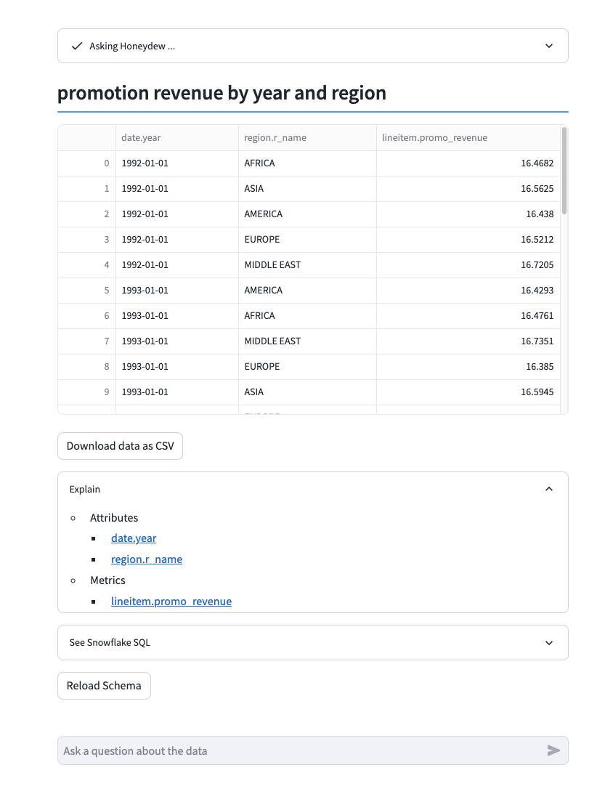

# Demo of Honeydew Native App + Snowflake Cortex LLM

This demo shows a simple integratio between Cortex and Honeydew in order to generate queries from English questions on semantics.

It uses the `tpch_demo` workspace.

Example output:

